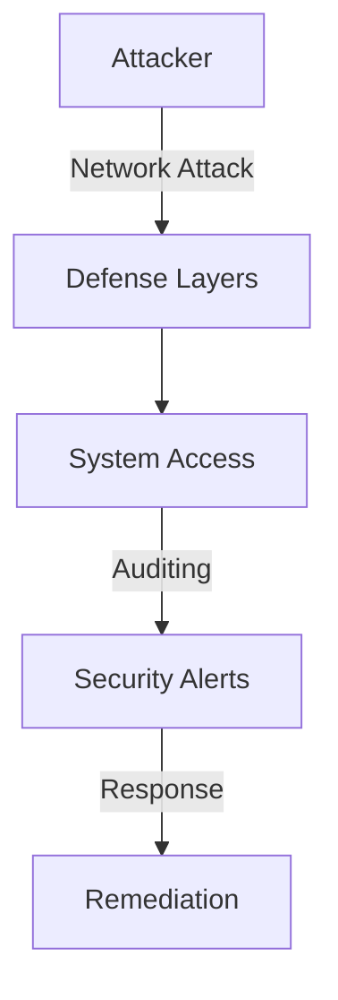
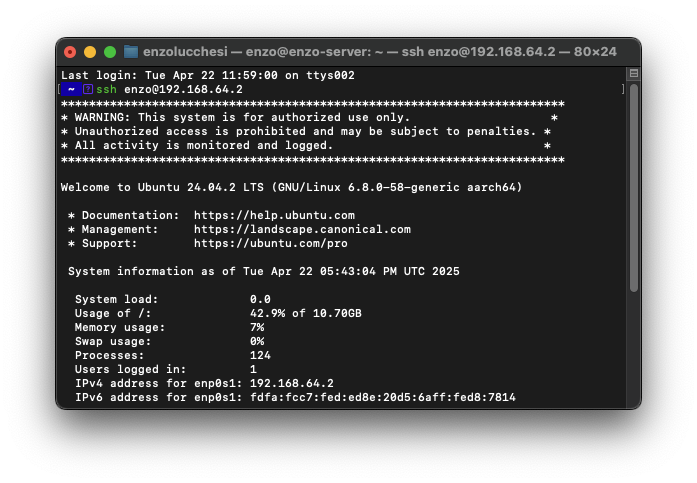
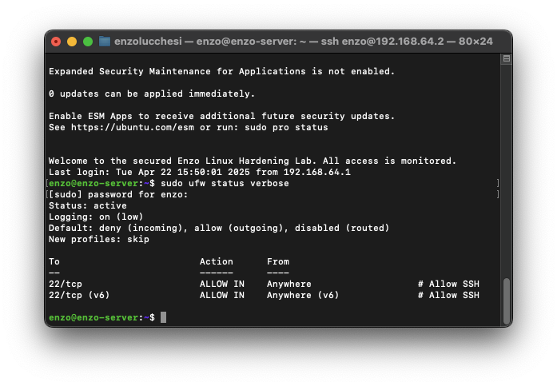
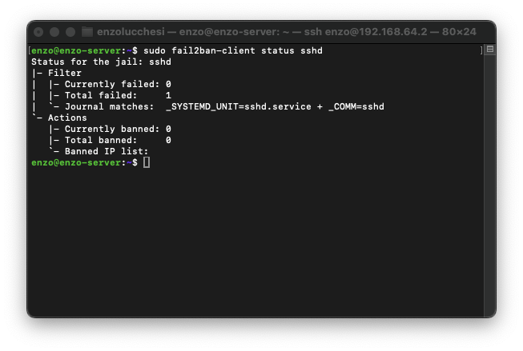
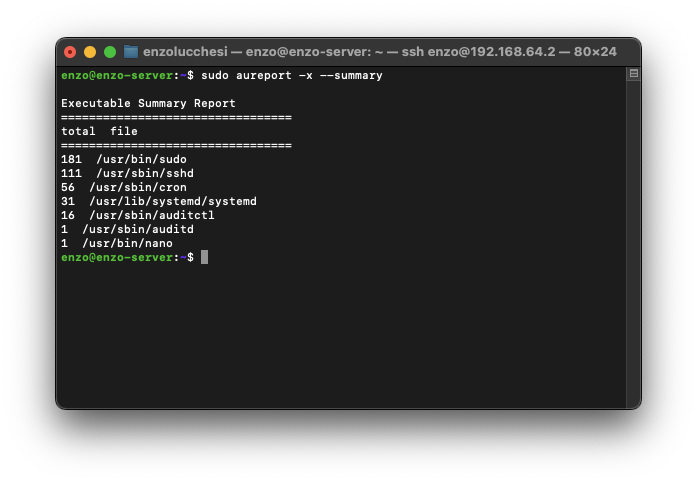

# Linux Server Hardening Framework

## Overview
This project provides a comprehensive modular framework for automated Linux server hardening (tested on Ubuntu 22.04 ARM). It implements common security best practices through a unified, configurable system that includes secure remote access, password policies, intrusion detection, audit logging, and kernel security parameters.

The framework has evolved from individual scripts to a modern modular architecture with centralized YAML configuration, consistent error handling, validation support, and comprehensive logging.

## 🔒 Security Impact

This project demonstrates key defensive security principles through layered security controls:

- **Defense in Depth**: Multiple security layers (firewall, IDS, authentication controls)
- **Least Privilege**: SSH key-only access, restricted root login
- **Automated Compliance**: Scripted enforcement of security configurations
- **Auditability**: Comprehensive logging with auditd
- **Maintainability**: Automated security updates and configuration management

### Threat Model



## ☁️ Cloud Security Relevance

While focused on on-prem servers, these hardening principles directly apply to cloud environments:

1. **Cloud Instance Hardening**: Same security controls protect cloud VMs
2. **Compliance Frameworks**: Meets requirements for CIS, NIST, ISO 27001
3. **Infrastructure as Code**: Scripts can be integrated into cloud init scripts
4. **Defense in Depth**: Layered approach aligns with cloud security best practices

---

## Hardening Areas Covered (Manual & Automated)
The project addresses the following hardening areas, now largely automated by the provided scripts:

-   **SSH Key-Only Login & Secure Configuration:** Disables password/root login, sets secure defaults.
-   **Firewall (UFW):** Installs UFW, sets default deny incoming/allow outgoing policies, allows SSH (OpenSSH & port 22/tcp), and enables the firewall.
-   **Intrusion Prevention (Fail2ban):** Installs and enables the SSH jail.
-   **Automatic Security Updates:** Installs `unattended-upgrades` and configures it to automatically apply security updates, including automatic reboots if required by an update.
-   **Password Policy Enforcement:** Installs `libpam-pwquality` and configures password complexity rules in `/etc/pam.d/common-password` and password aging policies in `/etc/login.defs`.
-   **Audit Logging (`auditd`):** Installs `auditd` and applies a baseline ruleset.
-   **Legal Warning Banner:** Sets a standard warning banner in `/etc/issue.net`.
-   **Kernel Parameters (`sysctl`):** Applies security-focused network, memory, and filesystem settings.

---

## Quick Start

The new modular hardening framework provides a unified interface for all security hardening operations.

### Basic Usage

1.  **Clone the Repository:**
    ```bash
    git clone https://github.com/lucchesi-sec/linux-server-hardening.git
    cd linux-server-hardening
    ```

2.  **Validate System:**
    ```bash
    sudo ./harden.sh --validate
    ```

3.  **Preview Changes (Dry Run):**
    ```bash
    sudo ./harden.sh -a --dry-run
    ```

4.  **Apply All Hardening:**
    ```bash
    sudo ./harden.sh -a
    ```

5.  **Check Results:**
    ```bash
    sudo ./harden.sh --validate
    ```

### Advanced Usage

```bash
# Apply specific modules
sudo ./harden.sh -m ssh           # SSH hardening only
sudo ./harden.sh -m ufw           # Firewall only
sudo ./harden.sh -m fail2ban      # Intrusion prevention

# Interactive mode
sudo ./harden.sh -i

# Custom configuration
sudo ./harden.sh -c configs/my-config.yaml -a

# Verbose output
sudo ./harden.sh -a --verbose

# Get help
./harden.sh --help
```

## Framework Architecture

### New Modular Structure

```
linux-server-hardening/
├── harden.sh              # Main hardening script
├── configs/
│   ├── default.yaml       # Default configuration
│   └── examples/          # Example configurations
├── src/
│   ├── core/              # Core framework
│   ├── modules/           # Hardening modules
│   ├── cli/               # CLI and output handling
│   └── validation/        # Validation engine
└── docs/                  # Documentation
    ├── MIGRATION_GUIDE.md # Legacy migration guide
    └── user/              # User documentation
```

### Available Modules

| Module | Description | Legacy Script |
|--------|-------------|---------------|
| `ssh` | SSH daemon hardening | `ssh-config/apply-ssh-config.sh` |
| `ufw` | Firewall configuration | UFW commands in various scripts |
| `sysctl` | Kernel security parameters | `sysctl/apply-sysctl-config.sh` |
| `fail2ban` | Intrusion prevention | `fail2ban/apply-fail2ban-config.sh` |
| `auditd` | Audit logging rules | `auditd-rules/apply-auditd-rules.sh` |
| `packages` | Security package installation | `install-packages.sh` |
| `pam` | Password policy enforcement | `password-policy/apply-pam-pwquality.sh` |
| `banner` | Legal warning banner | `banner/apply-banner.sh` |

### Configuration Management

All hardening settings are centralized in `configs/default.yaml`:

```yaml
# General settings
dry_run: false
verbose: false
backup_configs: true

# Enabled modules
enabled_modules:
  - ssh
  - ufw
  - sysctl
  - fail2ban

# Module-specific configuration
modules:
  ssh:
    permit_root_login: false
    password_authentication: false
    max_auth_tries: 3
    
  ufw:
    default_incoming: deny
    default_outgoing: allow
    allowed_ports:
      - 22/tcp
      - 80/tcp
      - 443/tcp
```

## Migration from Legacy Scripts

**Legacy scripts are now deprecation wrappers** that automatically redirect to the new system while showing migration notices.

### Legacy → New Mapping

```bash
# Old way (still works but deprecated)
./apply-all.sh                    → ./harden.sh -a
./src/modules/install-packages.sh             → ./harden.sh -m packages
./ssh-config/apply-ssh-config.sh  → ./harden.sh -m ssh
./sysctl/apply-sysctl-config.sh   → ./harden.sh -m sysctl
```

### Understanding Validation (`--validate`)
The validation engine performs a series of automated checks to verify that the hardening measures have been applied correctly. This typically includes:
- Verifying that key services (like `sshd`, `ufw`, `fail2ban`, `auditd`) are active and enabled.
- Checking critical configuration files (e.g., `/etc/ssh/sshd_config`, `/etc/fail2ban/jail.local`, `/etc/login.defs`, `/etc/pam.d/common-password`, `/etc/issue.net`, relevant `sysctl` values) for specific hardened settings.
- Confirming UFW rules are in place (e.g., default deny, allow SSH).
- Checking status of unattended upgrades.
Each check contributes to an overall hardening score. Review the script's output for detailed pass/fail status on individual checks.

**Prerequisites:**

*   A Debian/Ubuntu-based system (uses `apt`, `ufw`, `systemctl`).
*   `sudo` privileges.
*   `git` (to clone the repository).

**Warning:** These scripts modify critical system configurations. **Use them at your own risk.** Always back up important data before applying significant system changes. Testing in a non-production environment (like a VM) first is highly recommended.

#### Configuration Backups
Several of the `apply-*.sh` scripts take precautions when modifying system configurations. For instance, `ssh-config/apply-ssh-config.sh` creates a timestamped backup of your existing `/etc/ssh/sshd_config` (e.g., `/etc/ssh/sshd_config.bak_YYYYMMDD_HHMMSS`) before applying changes and attempts to restore it if validation fails.

While some scripts include such safety measures, it's good practice to review individual `apply-*.sh` scripts for their specific backup mechanisms. For comprehensive safety, especially before running `apply-all.sh` for the first time on a critical system, consider manually backing up key configuration directories or ensuring your system is snapshotted if running in a VM.

---

## 📸 Screenshots

### SSH Login with Legal Warning Banner


---

### UFW Firewall Status


---

### Fail2ban SSH Protection Status


---

### Auditd Executable Summary Report


---

## Tools and Technologies Used
- Ubuntu 22.04 LTS (ARM) - *Testing environment*
- UTM (virtualization on MacBook) - *Testing environment*
- Bash Scripting
- OpenSSH
- UFW Firewall
- Fail2ban
- Auditd / Ausearch / Aureport / Auditctl
- `sysctl`
- PAM (`libpam-pwquality` and `pam_pwquality.so`) for password complexity and aging enforcement
- Unattended Upgrades (APT)
- Git

---

## ELK Stack Integration (Optional)

For centralized logging and analysis of the data generated by the hardened server (e.g., `auditd`, `fail2ban`, `syslog`), consider integrating with an ELK (Elasticsearch, Logstash, Kibana) stack.

Basic installation scripts and integration guidance can be found in the [`elk-stack/`](./elk-stack/) directory and the accompanying [`elk-integration.md`](./elk-stack/elk-integration.md) document.

---

## Lessons Learned
- How to properly secure SSH access and avoid common misconfigurations.
- The importance of layering defensive controls (firewall + Fail2ban + key-based auth).
- How auditd works for tracking critical system events.
- Reinforced understanding of basic Linux administration and compliance-focused hardening techniques.
- The value of centralized logging (e.g., using ELK) for aggregating and analyzing security-relevant events (like auditd logs, firewall blocks, failed logins) from a hardened system.
- **The process of automating hardening steps using shell scripting.**
- Practical application of security concepts in a hands-on lab environment, transitioning from manual steps to automated solutions.

---

## Notes
This project provides scripts to apply foundational Linux security hardening steps. The setup provides a good baseline, but additional layers like AppArmor/SELinux, more comprehensive audit rules, IDS/IPS tools, specific file permission hardening, and centralized logging would be necessary next steps for a production or compliance-driven environment (e.g., DoD STIGs).
